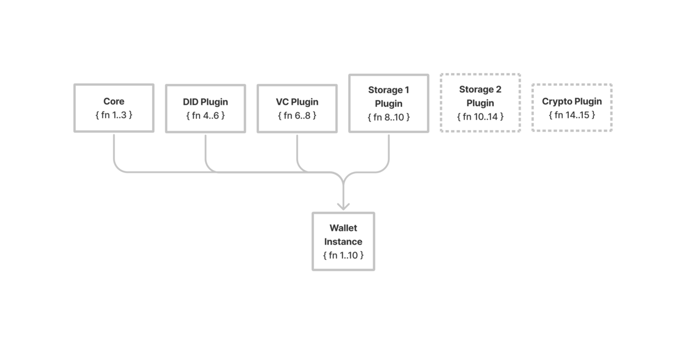

# Internet of Education – Network

The goal of the IoE Network is to design a pluggable Verifiable Credential (VC) and Verifiable Presentation (VP) protocol (VCP) inline with World Wide Web Consortium (W3C) international standards to enable interoperable and portable exchange, storage, and programmability of credentials.

# Background

With the introduction of decentralized identifiers (DIDs), VCs and VPs, credentialing has begun a digital transformation. There now exists mechanisms for any individual in the world to issue a verifiable credential to anyone else, for that individual to verify and validate the credential, store it, and use it as proof with third parties in similarly verifiable ways. 

With these mechanisms in place, protocols focused on supporting the exchange, usage, analysis, and programmability of VC/Ps through interoperable formats can be built.

# Introduction

VCs have the capability to transform credentialing frameworks and models from static, transactional, and trust-based to dynamic, programmable, and trustless. This requires more than just DIDs and VCs. The systems and protocols in which these standards operate need careful consideration. 

Initial use cases have focused on transitioning analog credentialing systems to digital, but that has led to closed, isolated verticals, and prevented the cambrian explosion or network effect that has been seen in the more composable worlds of crypto and web3. 

Building an open network for credential exchange and presentation allows for higher inclusivity leading to accelerated adoption and the emergence of new use cases. 

The IoE Network is an open credential network, focused on building an interoperable protocol for the exchange, storage, and presentation of VCs.

# Credential Exchange Example

1. Alice has completed an online course teaching skill X and taken an exam that measures what she’s learned.
2. She has earned herself a passing grade on the exam demonstrating understanding of skill X.
3. Upon completion, a skill credential capturing this is prepared by the course provider, Bob.
4. Bob uses Alice’s known DID, a course credential template, and his known DID to construct and sign a verifiable credential (VC). 
5. Bob then uses an exchange mechanism agreed upon by him and Alice to send the VC. 
6. Alice receives the VC.
7. Alice verifies the VC was signed by Bob by comparing the VC signature against the expected DID of Bob.
8. Alice validates the VC represents the correct skill credential by comparing the credential object against the expected credential template.
9. Alice confirms the VC is accurate and decides to store it in her preferred storage mechanism. 

# Presentation Exchange Example

1. Alice would like to apply for a job that requires skill X as a competency.
2. Alice knows skill X and has proof in the form of a verifiable credential (VC).
3. Alice’s VC was issued by a reputable issuer A and feels she qualifies for the job, so she decides to apply. 
4. As part of the application process, Alice is asked to prove she knows skill X by presenting a VC to verifier, Bob.
5. Bob sends over a proof request to Alice through an exchange protocol agreed upon.
6. Alice receives the proof request.
7. Alice deconstructs the proof request to confirm it is requesting skill X proof.
8. Alice queries her credential data stores for skill X VC.
9. Alice prepares a verifiable presentation (VP) of her VC. 
10. Alice’s VP may utilize cryptographic techniques to minimize what is disclosed, prevent signature correlation, etc, but it at minimum proves to Bob she contains a VC of skill X by issuer A.
11. Alice exchanges the VP with Bob using an agreed upon protocol.
12. Bob receives the VP.
13. Bob verifies the VP was signed by Alice by comparing the VP signature against the expected DID of Alice.
14. Bob deconstructs the VP to verify the VC proof proves skill X and expected issuer A.
15. Alice’s job application now contains proof of skill X.

# Goals

* Support core protocol procedures – issue, exchange, store, present VC through a unified interface.
* Open source and extendable – mechanisms for supporting various implementations of protocol procedures, including BYOI (bring your own implementation).
* Open network – any agent can participate in the protocol, given minimal technical requirements.

# Definitions

* **Credential** – a set of one or more claims made by an issuer
* **Decentralized identifier** – a portable URL-based identifier, also known as a DID, associated with an entity. These identifiers are most often used in a verifiable credential and are associated with subjects such that a verifiable credential itself can be easily ported from one repository to another without the need to reissue the credential. An example of a DID is did:example:123456abcdef.
* **Decentralized identifier document** – also referred to as a DID document, this is a document that is accessible using a verifiable data registry and contains information related to a specific decentralized identifier, such as the associated repository and public key information.
* **Holder** – A role an entity might perform by possessing one or more verifiable credentials and generating presentations from them. A holder is usually, but not always, a subject of the verifiable credentials they are holding. Holders store their credentials in credential repositories.
* **Issuer** – A role an entity can perform by asserting claims about one or more subjects, creating a verifiable credential from these claims, and transmitting the verifiable credential to a holder.
* **Key material **– the cryptographic secrets that compose a key.
* **Presentation** – data derived from one or more verifiable credentials, issued by one or more issuers, that is shared with a specific verifier.
* **Protocol** – official set of procedures for what actions to take in a certain situation
* **Relying Party **– A role an entity performs by receiving one or more verifiable credentials, optionally inside a verifiable presentation for processing.
* **Subject** – A thing about which claims are made.
* **Triangle of Trust** – three roles of the “trust triangle” which make credentials of any kind work: issuing the credential, holding it in a wallet, and verifying it when it's presented by the holder.
* **Verifiable credential **– a tamper-evident credential that has authorship that can be cryptographically verified.
* **Verifiable presentation** – tamper-evident presentation encoded in such a way that authorship of the data can be trusted after a process of cryptographic verification.

# Protocol

## Overview

The protocol is an interoperable set of procedures that enables the exchange of VCs between network participants. This includes auxiliary procedures built to support exchange, such as constructing, signing, storing, retrieving, etc. 

The diagram below captures the responsibilities of procedures and engagements of triangle of trust participants during typical exchange workflows. 

_Diagram Credit: Kim Hamilton & Nathan Tonani_

## Participants

* **Issuer**
* **Subject**
* **Holder**
* **Relying Party**

## Procedures

List of core procedures plus suggested supplemental ones.

### Core

#### **1 Construct credential** 

    Construct a credential object provided a credential template, subject identifier, and subject data.

    **Inputs:**

* Credential template: A specific credential object with subject and signer details omitted
* Subject identifier: A subject’s DID
* Subject data: Any further information needed for credential

    **Outputs:**

* A constructed credential object

#### **2 Issue credential**

    Output a signed VC provided a credential object.

    **Inputs:**

* Credential object: constructed credential object
* Signing method: method for signing credential

    **Outputs:**

* Signed VC: Signed VC wrapper of raw credential object

#### **3 Exchange credential**

    Exchange VC provided a VC and target identifier.

    **Inputs:**

* VC: Signed VC wrapper with raw credential object
* Target identifier: a mechanism for identifying who and how to exchange the VC with

    **Outputs: **

* Exchange record

#### **4 Verify & validate credential**

    Validate credential and verify signer provided VC.

    **Verify inputs: **

* DID resolution: a mechanism for resolving an issuer’s DID
* Proof method: a key signature method
* DID verification: expected issuer’s DID

    **Verify outputs:**

* VC, if successfully verified

    **Validate inputs:**

* Validation mechanism: a way to validate the contents of a credential are as expected

    **Validate outputs:**

* VC, if successfully validated

#### **5 Store credential**

    Store provided VC.

    **Inputs:**

* VC: signed VC wrapper with raw credential object
* Auth details: any authn/z details required to persist in storage

    **Outputs:**

* Storage identifier: identifier for successful storage of VC

#### **6 Construct presentation**

    Construct a presentation provided a set of VCs.

    **Inputs:**

* VC list: All VCs intended to be wrapped in a presentation object

    **Outputs:**

* Presentation object

#### **7 Prove presentation**

    Output a signed VP provided a presentation object.

    **Inputs:**

* Raw presentation object
* Signing method: method for signing presentation object

    **Outputs:**

* Signed VP: signed VP wrapper of raw presentation object

#### **8 Exchange presentation**

    Exchange VP provided a VP and target identifier.

    **Inputs:**

* VP: Signed VP wrapper with raw presentation object
* Target identifier: a mechanism for identifying who and how to exchange the VP with

    **Outputs: **

* Exchange record

#### **9 Verify & validate presentation**

    Validate presentation and verify signer provided VP.

    **Verify inputs: **

* DID resolution: a mechanism for resolving an issuer’s DID
* Proof method: a key signature method
* DID verification: expected issuer’s DID

    **Verify outputs:**

* VP, if successfully verified

    **Validate inputs:**

* Validation mechanism: a way to validate the contents of a presentation and credentials underneath are as expected

    **Validate outputs:**

* VP, if successfully validated

### Support

* **Select identifier** – Construct or retrieve a DID document.
* **Request issuance **– Construct a VC issuance request provided DID, credential identifier, and target.
* **Request presentation **– Construct a VP issuance request provided DID, credential identifiers, and target.
* **Request exchange **– Exchange requests given a request object and target identifier.
* **Credential templates **– Retrieve a credential template provided a credential template identifier.
* **Query VCs** – Given query parameters, query and return matching VCs.

# Wallet

## Overview

The wallet encapsulates the protocol as a standard interface developers can integrate into their applications. The wallet specification is open source and can be used by anyone. The purpose is to allow developers supporting VC exchange use cases to have a single library that handles all major procedures as outlined above, abstracting out specific details so they can focus on their own business logic.

## Plugin Framework

At the wallet’s core is a suite of plugins, enabling developers to choose what functionality they will support in their application. The following is an example of a wallet instance that supports one storage mechanism while omitting another:

Building the protocol as a set of plugins allows for standard protocol call patterns to improve over time with best practices. It prevents vendor lock-in and encourages support for a broad set of solutions. 

## Providers

Plugins are provided by community and core contributors. Given the plugin’s nature, they may also host and maintain infrastructure necessary to sustain its call patterns. For example, an IPFS storage provider might also provide a pinning service, a DID document provider might host document endpoints, etc.

These details are to be provided along with the plugin. 

# To Dos 

This initial draft is meant to establish a conceptual understanding of the high-level design of the proposed IoE Network protocol. It should not be considered complete or final. It represents a proposed design for public comment. Future revisions will address incomplete elements and currently unforeseen issues or challenges. Next, a standard-comformant, open source reference implementation and SDK for wallets will be developed, as well as a reference implementation. 

# Feedback 

Our goal is to develop this as an open source project for the public good. Everyone is open and welcome to provide input on design decisions made. 
